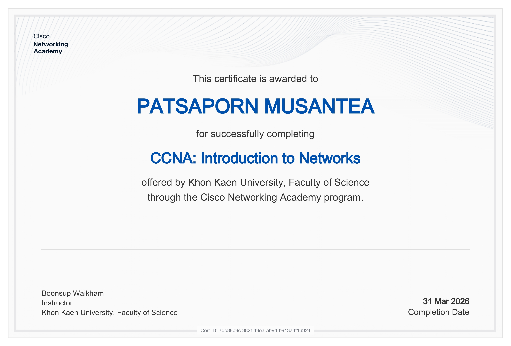
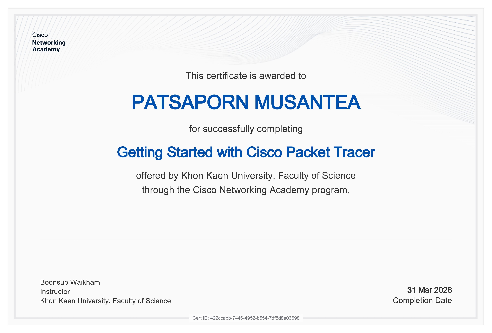
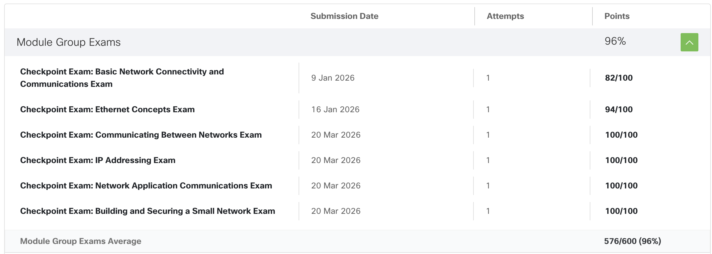

# 🌐 Network Portfolio

---

## 👤 Student Information
**Name:** พรรษพร มุสันเทียะ
**ID:** 673380051-7
**Status:** Networking & Systems Student

---

## 🎖️ Professional Qualifications

  <table border="0">
    <tr>
      <td align="center" width="50%">
         
        <b>CCNA: Introduction to Networks</b>
      </td>
      <td align="center" width="50%">
         
        <b>Cisco Packet Tracer Mastery</b>
      </td>
    </tr>
  </table>

---

## 📈 Academic Analytics
**Learning Progress & Module Completion** 

---

## 📂 Laboratory & Project Hub

### 🛠️ Individual Assignments
| Topic | Description | Link |
| :--- | :--- | :--- |
| **Philosophy** | Personal Essay & Goals | [📄 View Doc](https://docs.google.com/document/d/11yY6bMJL7le0beY4RvXXi06hE5Loagw8DYOQDVm_Bgw/edit?usp=drivesdk) |
| **Architecture** | Network Topology Design | [🗺️ View Doc](https://docs.google.com/document/d/1hgPHTfacE8fiHcPe6s-djxHBjGJPxPO-/edit?usp=drivesdk&ouid=104430499386095562864&rtpof=true&sd=true) |
| **Analysis** | TCP vs UDP In-depth | [🔌 View Doc](https://drive.google.com/file/d/1jF6CttQTi6i_XRYGLXZELeKIwGtKORwN/view?usp=sharing) |
| **Development** | Not Simple Project | [📁 Drive](https://docs.google.com/document/d/1Uem4Icre3QLpXhXFLNBOJudJUD-FMpIN6rFUgXOQmbY/edit?usp=sharing) |
| **Hands-on** | Lab 5 | *(Processing...)* |

### 👥 Collaborative Workshops
* **Documentation Series:**
    * [Lab 01](https://docs.google.com/document/d/1LTyeTCxfYjoqUJnsBHURvWGh1Y410z-8Ah7sDqklG1c/edit?usp=sharing) / [Lab 02](https://docs.google.com/document/d/1BMCTrAFfA2mMvrydhwGSf1R466rwE9007YExsYK6FT8/edit?usp=sharing)
    * [Lab 03](https://docs.google.com/document/d/1ay9XhTljggX9RlXcrCvseNOeFKb2ts6Vrp4NaN4QIF8/edit?usp=sharing) / [Lab 04](https://docs.google.com/document/d/1MURDTx2FsTknknAwdjMUKIodGjyuBXNKRkQBv0g-u0M/edit?usp=sharing)
* **Team Folders:**
    * [New Network Design](https://drive.google.com/drive/folders/1MyOYWLl1D9psgolZ1Y_Tp7nPIAeupHDz?usp=sharing)
    * [Sprint Alpha Resources](https://drive.google.com/drive/folders/1ejW6vdKICTaLfQ-hjtxQ_FZ4tm3Ojcpy?usp=sharing)

---

## 🚀 Key Highlights

### 🏆 Featured Project: HapticNetwork
A comprehensive capstone involving advanced networking implementations.
- **Project Assets:** [Google Drive](https://drive.google.com/drive/folders/1JaiOpJeRT33JaBn1Av1e7NAkkaVtYpW-?usp=sharing)
- **Source Code:** [GitHub Repository](https://github.com/jrKitt/HapticNetwork.git)

<!--### 💻 Classroom Development
Continuous code updates and workshop scripts.
- **Workshop Repo:** [network-class](#)-->

---
*Created by Sorawit T. - 2026*
